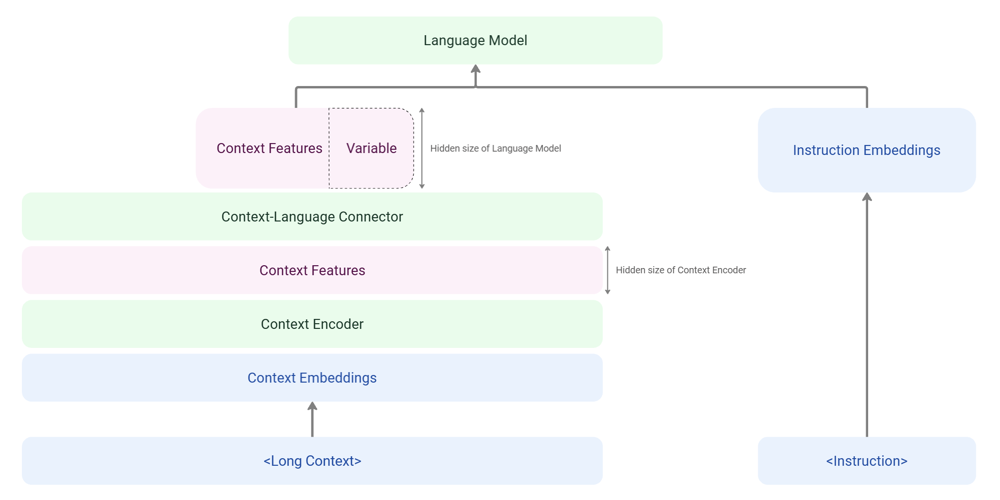
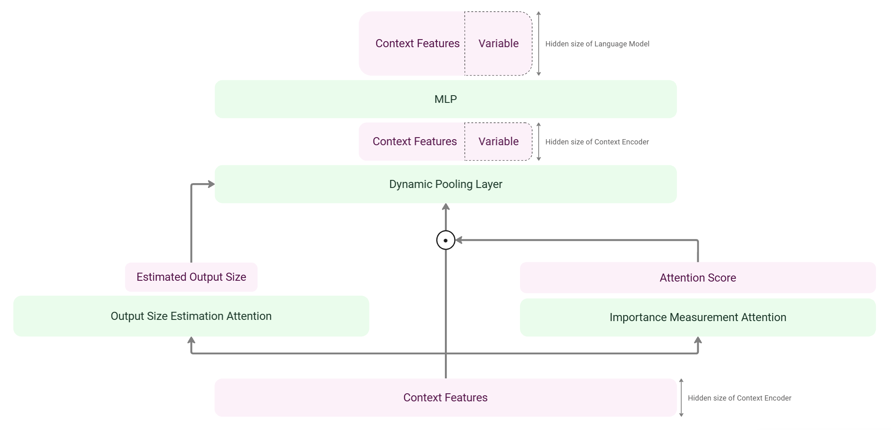

# Co-Encoder: Context Compressive Encoder in Large Language Models
Designing and implementing the Co-Encoder architecture compatible with the Transformers library,  including its end-to-end training pipeline and associated components.

## Archtecture

### Co-Encoder overall architecture

### Connector architecture
